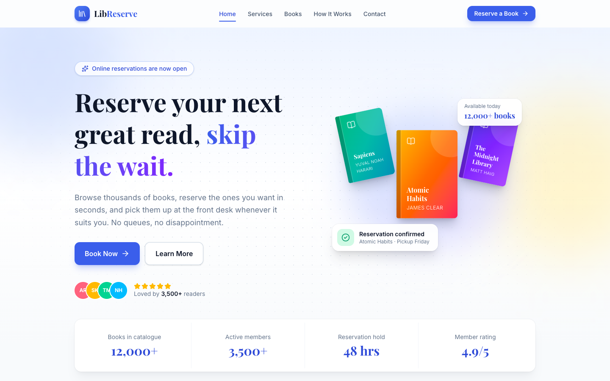
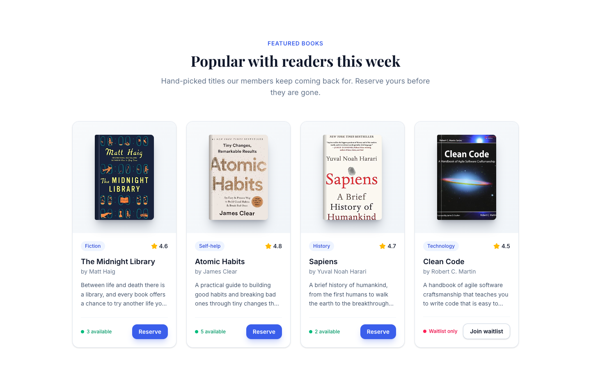
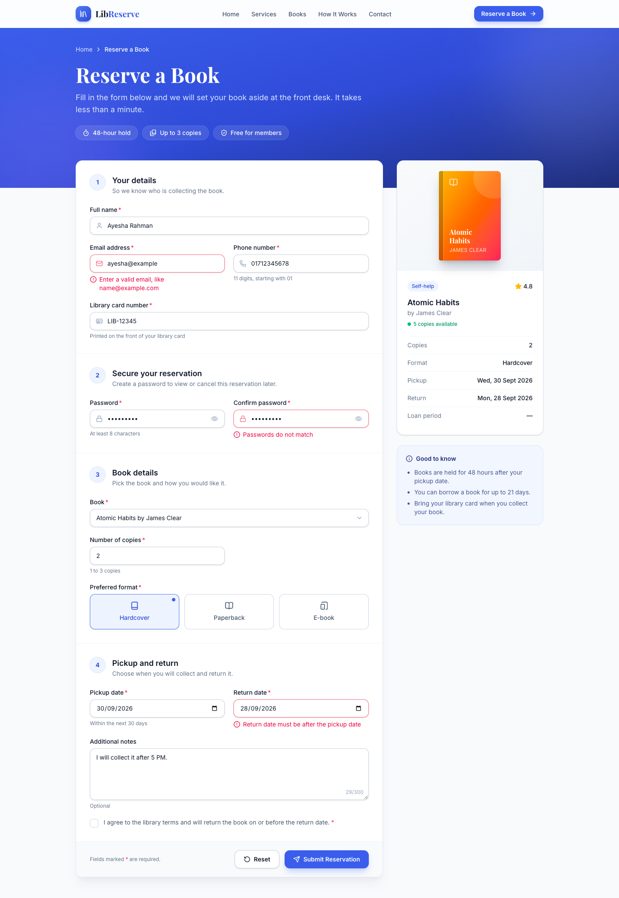
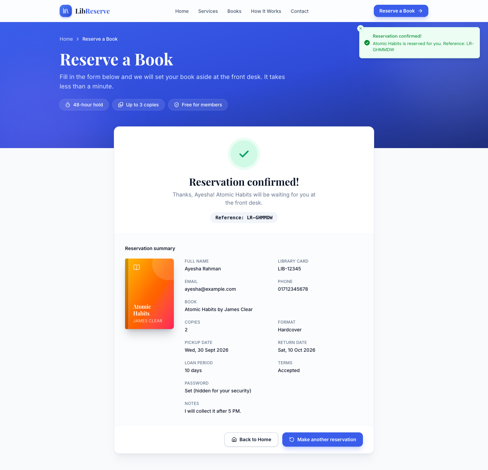

# LibReserve: Library Book Reservation System

**Live demo:** [library-reservation-mauve.vercel.app](https://library-reservation-mauve.vercel.app/)  
**Source code:** [github.com/AbulBashar38/library-reservation](https://github.com/AbulBashar38/library-reservation)

LibReserve is a responsive web app that lets library members reserve a book online and pick it up at the front desk, instead of queuing or phoning in. It has two connected pages: a **landing page** that introduces the library and its featured books, and a **reservation page** where the user fills in a validated form and gets an on-screen confirmation.

It is built with React, React Router, Tailwind CSS, Framer Motion, React Hook Form, Zod, and Sonner. It runs entirely in the browser, with no backend.

This is an individual lab assignment for the **Information System Design and Software Engineering Lab** course. The goal is to turn a system's user requirements into a working, responsive UI.

---

## Screenshots

### 1. Hero section

The first thing a visitor sees: a clear headline, a primary **Book Now** button and a secondary **Learn More** button, animated floating book covers, and a strip of key numbers.



### 2. Featured books

Cards for popular books, each with a cover, genre, rating, short description, live availability, and a **Reserve** button. Clicking **Reserve** opens the form with that book already selected. Books with no copies left offer a waitlist instead.



### 3. Reservation form

An 11-field form in three numbered steps, with a live preview of the chosen book beside it. Errors appear directly under the field they belong to. In this screenshot, an invalid email and a return date set before the pickup date are both flagged.



### 4. Reservation confirmed

After a valid submission, a success toast appears and the form is replaced by a confirmation with an animated tick, a reference number, and a summary of everything the user entered.



---

## About the Project

**The problem:** borrowing a popular book usually means visiting the library and hoping a copy is on the shelf. LibReserve lets members check what is available, reserve it online in under a minute, and collect it within 48 hours of their chosen pickup date.

**How a visitor uses it:**

1. Land on the Home page, read about the services, and browse the featured books.
2. Click **Book Now** or a book's **Reserve** button to open the reservation form.
3. Enter their details, choose the book, copies, format, and pickup and return dates, and accept the terms.
4. Submit. If anything is wrong, each problem is explained next to its field. If everything is valid, they see a confirmation with a reference number and a summary of their reservation.

**Highlights:**

- **Responsive:** works on phones, tablets, and desktops, with a hamburger menu on small screens.
- **Validation in one place:** all form rules live in a single Zod schema, including cross-field rules such as "return date must be after pickup date".
- **Clear feedback:** an error message under each invalid field, toast notifications, and a loading state on submit.
- **Polished motion:** page transitions, scroll-reveal cards, hover effects, and an animated success tick, all switched off for users who prefer reduced motion.
- **Accessible:** labelled inputs, errors linked to fields with `aria-describedby`, keyboard-friendly controls, and visible focus rings.
- **Maintainable:** small reusable components (`Button`, `TextInput`, `Field`, and more), with page content kept in separate data files.

> **No backend.** Everything runs in the browser. Submitted form data is only shown on screen and is not saved anywhere.

---

## Tech Stack

| Tool                                                                | Purpose                                                             |
| ------------------------------------------------------------------- | ------------------------------------------------------------------- |
| [React](https://react.dev/)                                         | Building the UI from components                                     |
| [React Router DOM](https://reactrouter.com/)                        | Moving between the Home and Reservation pages without a page reload |
| [Tailwind CSS](https://tailwindcss.com/)                            | Styling and responsive layout with utility classes                  |
| [Framer Motion](https://motion.dev/)                                | Page transitions, scroll reveals, and hover and tap animations      |
| [React Hook Form](https://react-hook-form.com/)                     | Managing form state, submission, and reset                          |
| [Zod](https://zod.dev/)                                             | Defining the validation rules as a single schema                    |
| [@hookform/resolvers](https://github.com/react-hook-form/resolvers) | Connecting the Zod schema to React Hook Form                        |
| [Sonner](https://sonner.emilkowal.ski/)                             | Toast notifications for success and error messages                  |
| [Lucide React](https://lucide.dev/)                                 | Icons for cards, the navbar, and the footer                         |
| [Vite](https://vitejs.dev/)                                         | Development server and production build                             |

---

## UI and Design

The UI is designed to look clean, modern, and polished, not just to meet the requirements.

- **Consistent design system**: one colour palette, one type scale, and consistent spacing and rounded corners, all set in the Tailwind config.
- **Clear visual hierarchy**: a bold hero heading, a solid primary button, an outlined secondary button, and cards with soft shadows.
- **Smooth animations** with Framer Motion:
  - pages fade and slide in when the route changes
  - the hero text and buttons animate in on first load
  - cards fade up one after another as they scroll into view
  - buttons and cards respond to hover and tap
  - the mobile menu slides open and closed
  - error messages animate in below their fields
- **Friendly feedback**: toast notifications confirm a successful reservation or warn when the form has errors.
- **Accessible**: form fields have labels, errors are linked to their inputs with `aria-describedby`, buttons have visible focus rings, and colours have enough contrast.

---

## Pages

### Page 1: Home (`/`)

Introduces the library to a first-time visitor.

- **Navigation bar**: at least 4 links (Home, Books, About, Reserve), one of which goes to the Reservation page. On small screens the links collapse into a hamburger menu that opens and closes when tapped.
- **Hero section**: a heading, a short description of the service, and two call-to-action buttons:
  - **Reserve a Book**, the primary button, which goes to the Reservation page
  - **Learn More**, the secondary button, which scrolls to the content section
- **Content section**: at least 3 cards, such as featured books or library services. Each card has an image or icon, a title, a short description, and a button.
- **Footer**: the library's contact details (address, email, phone) and social media links with icons.

### Page 2: Reservation Form (`/reserve`)

Collects a book reservation request from the user. The page has three parts:

1. **The form**: 11 fields in three numbered sections (Your details, Book details, Pickup and return).
2. **A live preview sidebar**: shows the chosen book's cover, availability, and the dates and loan period as you type.
3. **A success screen**: replaces the form after a valid submission, with an animated tick, a reference number, and a summary of everything entered.

Clicking **Reserve** on a book card on the Home page opens `/reserve?book=<id>`, which pre-selects that book.

**Fields (11 fields, 9 input types):**

| Field                  | Input type | Rules                                                         |
| ---------------------- | ---------- | ------------------------------------------------------------- |
| Full Name              | `text`     | Required, 3–50 characters, letters only                       |
| Email                  | `email`    | Required, valid email format                                  |
| Phone Number           | `tel`      | Required, 11 digits starting with `01` (e.g. `01712345678`)   |
| Library Card Number    | `text`     | Required, format `LIB-12345`                                  |
| Book                   | `select`   | Required, must be a book from the catalogue                   |
| Number of Copies       | `number`   | Required, whole number from 1 to 3                            |
| Preferred Format       | `radio`    | Hardcover, Paperback, or E-book                               |
| Pickup Date            | `date`     | Required, not in the past, within the next 30 days            |
| Return Date            | `date`     | Required, **after the pickup date**, at most 21 days after it |
| Additional Notes       | `textarea` | Optional, up to 300 characters (live counter)                 |
| Agree to Library Terms | `checkbox` | Must be ticked                                                |

**Client-side validation** (defined in one Zod schema in [`src/schemas/reservationSchema.js`](src/schemas/reservationSchema.js) and connected to React Hook Form with `zodResolver`):

- **Required fields**: every required field shows its own "… is required" message.
- **Email format**: checked with Zod's `.email()`.
- **Pattern / length rules**: regex patterns for the phone number, library card number, and name; length limits for the name and notes.
- **Cross-field rules**: the Return Date must be after the Pickup Date, and the loan can be at most 21 days. Both use `.refine()` on the whole object with `path: ['returnDate']`, so the error appears under the Return Date field. The `when` option lets these rules run as soon as both dates are filled in, even while other fields still have errors.

**Behaviour:**

- Fields are checked when the user leaves them, then re-checked on every change (`mode: 'onTouched'`).
- An error message appears **directly below the field** it belongs to, not in a single alert box. Invalid fields also get a red border, and errors are linked to their inputs with `aria-describedby`.
- **Submit** checks every field.
  - If any field is invalid, an error toast says how many fields need fixing, and the first invalid field gets focus.
  - If all fields are valid, the button shows a loading spinner for a moment (a pretend server request), then a success toast appears and the success screen with the full summary animates in.
- **Reset** clears all fields and error messages using React Hook Form's `reset()`.
- **Make another reservation** on the success screen goes back to a fresh form.

> Toasts are extra feedback only. The required per-field error messages are always shown next to their fields.

---

## Responsive Design

The layout adapts to mobile, tablet, and desktop screens using Tailwind's responsive breakpoints (`sm`, `md`, `lg`):

- The navbar shows a hamburger toggle on small screens.
- The cards stack in one column on mobile and sit side by side on larger screens.
- The form fields stack on mobile and use a two-column grid on wider screens.

---

## Project Structure

```text
library-reservation/
├── index.html              # HTML entry point, loads Google Fonts
├── vite.config.js          # Vite config with the React and Tailwind plugins
├── public/                 # Static files served as-is (favicon)
├── docs/screenshots/       # Images used in this README
└── src/
    ├── main.jsx            # Mounts the app inside BrowserRouter
    ├── App.jsx             # Routes, with AnimatePresence for page transitions
    ├── index.css           # Tailwind import and design tokens (colours, fonts)
    ├── components/
    │   ├── layout/         # Shared on every page
    │   │   ├── Layout.jsx      # Navbar + page + Footer + Toaster
    │   │   ├── Navbar.jsx      # Sticky navbar with animated hamburger menu
    │   │   ├── Footer.jsx      # Contact info, opening hours, social links
    │   │   └── Logo.jsx
    │   ├── ui/             # Small reusable building blocks
    │   │   ├── Button.jsx      # primary / secondary / ghost / light variants
    │   │   ├── Container.jsx   # Centred max-width wrapper
    │   │   ├── SectionHeading.jsx
    │   │   ├── Reveal.jsx      # Fade-up on scroll (Framer Motion)
    │   │   ├── PageTransition.jsx
    │   │   ├── BookCover.jsx   # CSS-drawn book cover
    │   │   └── SocialIcons.jsx
    │   ├── home/           # Sections of the Home page
    │   │   ├── Hero.jsx
    │   │   ├── Stats.jsx
    │   │   ├── Services.jsx + ServiceCard.jsx
    │   │   ├── FeaturedBooks.jsx + BookCard.jsx
    │   │   ├── HowItWorks.jsx
    │   │   └── CtaBanner.jsx
    │   ├── form/           # Reusable form controls with label + error message
    │   │   ├── Field.jsx       # Label, hint, and animated error message
    │   │   ├── TextInput.jsx   # text / email / tel / number / date
    │   │   ├── SelectInput.jsx
    │   │   ├── TextArea.jsx    # With character counter
    │   │   ├── RadioCards.jsx
    │   │   ├── Checkbox.jsx
    │   │   └── styles.js       # Shared input classes and ARIA helper
    │   └── reserve/        # Parts of the Reservation page
    │       ├── ReserveHeader.jsx
    │       ├── ReservationForm.jsx   # React Hook Form + Zod
    │       ├── FormSection.jsx
    │       ├── BookPreview.jsx       # Live summary sidebar
    │       └── ReservationSuccess.jsx
    ├── data/               # Content kept separate from the components
    │   ├── books.js        # Catalogue (featured books + all books in the dropdown)
    │   ├── formats.js
    │   ├── services.js     # Services, steps, and stats
    │   ├── navigation.js
    │   ├── contact.js
    │   └── social.js
    ├── schemas/
    │   └── reservationSchema.js  # All form validation rules (Zod)
    ├── utils/
    │   └── date.js         # Date helpers for the date inputs
    ├── hooks/
    │   ├── useScrollToHash.js  # Scrolls to #section links after navigation
    │   └── useScrolled.js      # Adds the navbar shadow after scrolling
    └── pages/
        ├── Home.jsx        # Page 1: landing page (/)
        ├── Reserve.jsx     # Page 2: reservation form (/reserve)
        └── NotFound.jsx    # Fallback for unknown URLs
```

---

## Getting Started

**Prerequisites:** [Node.js](https://nodejs.org/) 18 or newer, and npm.

```bash
# Clone the repository
git clone https://github.com/AbulBashar38/library-reservation.git
cd library-reservation

# Install dependencies
npm install

# Start the development server
npm run dev
```

Then open the local URL printed in the terminal, usually `http://localhost:5173`.

```bash
# Build for production
npm run build

# Preview the production build
npm run preview
```
